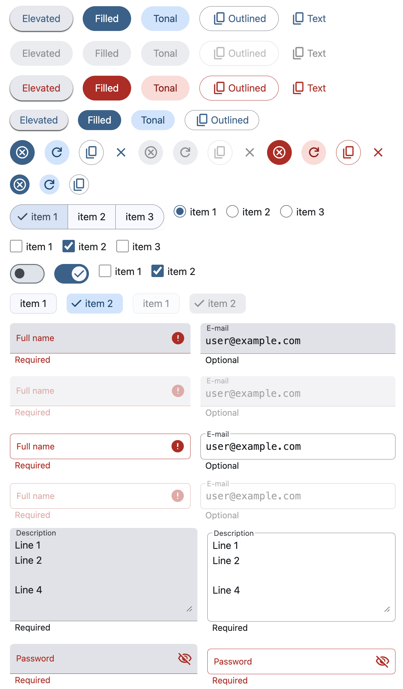

# CoarsePaper

Some Material Design 3-like components



Inspired by

-   [Material Theme Builder](https://material-foundation.github.io/material-theme-builder/)
-   [Material Symbols and Icons](https://fonts.google.com/icons)
-   [Svelte](https://svelte.dev/)
-   [Tailwind](https://tailwindcss.com/)
-   [HyperUI](https://www.hyperui.dev/)
-   [Mamba UI](https://mambaui.com/)

## Prerequisites

-   node >= 20

## Build

```bash
git clone git@github.com:MichinobuMaeda/coarse-paper.git
cd coarse-paper
npm install
npm start
```
